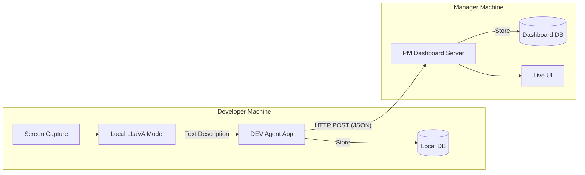

# FlowSight AI

**Real-time privacy-first developer activity monitoring powered by local AI.**

FlowSight AI consists of two lightweight desktop applications that work together to provide insights into developer activity without compromising privacy. It uses local LLMs to analyze screen content and transmits *only* text descriptions to a central dashboard.

## 🚀 Features

*   **Privacy First**: Screenshots are analyzed locally on your machine. **Images never leave your device.**
*   **Local Intelligence**: Uses [Ollama](https://ollama.ai) and LLaVA (Large Language-and-Vision Assistant) to understand screen context.
*   **Real-time Dashboard**: Team leads or project managers can see live activity feeds in text format.
*   **Automatic Categorization**: Activities are automatically tagged (Coding, Browsing, Meeting, Terminal, etc.).
*   **No Cloud Dependencies**: Operates entirely within your local network.

## 📦 Architecture

The system is composed of two Tauri (Rust + Web Frontend) applications:

### 1. DEV Agent (`@flowsight/agent`)
*   **Role**: Client application running on developer machines.
*   **Function**:
    *   Captures screen content every **10 seconds** (configurable).
    *   Sends the image to a local Ollama instance running `llava:7b`.
    *   Receives a text description of the activity.
    *   Sends the *text description* and metadata to the PM Dashboard.
    *   Stores a local history of reports in a SQLite database.
*   **Tech**: Tauri (Rust), SQLite, Ollama API.

### 2. PM Dashboard (`@flowsight/pm`)
*   **Role**: Server/Dashboard application for the team lead.
*   **Function**:
    *   Runs a local HTTP server (default port `8080`) to receive reports.
    *   Displays a real-time feed of team activity.
    *   Shows team stats (online status, activity breakdown).
    *   Manages API keys for authentication.
*   **Tech**: Tauri (Rust), SQLite, embedded HTTP Server.



## 🛠️ Prerequisites

*   [Rust 1.77+](https://rustup.rs)
*   [Node.js 18+](https://nodejs.org) (with pnpm)
*   [Ollama](https://ollama.ai) installed and running.

## 🏁 Quick Start

### 1. Setup

Install project dependencies:
```bash
pnpm install
```

### 2. Start PM Dashboard (Manager)

Run the dashboard to generate an API Key and start the server.

```bash
pnpm dev:pm
```
*   The app will launch.
*   Go to the **Settings** tab (implied) or look at the console/UI to find your **API Key**.
*   Ensure the server is running (default: `http://localhost:8080`).

### 3. Start DEV Agent (Developer)

Run the agent on the developer machine.

```bash
pnpm dev:agent
```

*   **Configuration**:
    *   **PM URL**: The IP/URL of the PM Dashboard (e.g., `http://192.168.1.5:8080` or `http://localhost:8080` if testing locally).
    *   **API Key**: Paste the key generated by the PM Dashboard.
    *   **Vision Model**: Default is `llava:7b`.
*   **Ollama Setup**: The agent will prompt you to install Ollama and pull the `llava:7b` model if not present.

## ⚙️ Configuration

### Agent Configuration (`dev-agent.db`)
*   `capture_interval`: Time in milliseconds between captures (Default: `10000` aka 10s).
*   `vision_model`: Local LLM model to use (Default: `llava:7b`).
*   `pm_url`: URL of the PM Dashboard.

### PM Configuration (`pm-dashboard.db`)
*   `server_port`: HTTP port for the receiver server (Default: `8080`).
*   `retention_days`: How long to keep reports (Default: 7 days).
*   `team_name`: Display name for the dashboard.

## 🔌 API Reference (PM Dashboard)

The PM Dashboard exposes the following endpoints (headers required: `X-API-Key`):

*   `POST /api/report`: Submit a new activity report.
    *   Body: `{ "developer_name": "...", "description": "...", "activity_type": "..." }`
*   `GET /api/developers`: List all tracked developers and online status.
*   `GET /api/stats`: Get dashboard statistics.
*   `GET /health`: Health check (No auth required).

## 🏗️ Building for Production

Build optimized binaries for your platform:

```bash
# Build both apps
pnpm build

# Build individual apps
pnpm build:agent
pnpm build:pm
```

Executables will be located in:
*   `apps/agent/src-tauri/target/release/`
*   `apps/pm/src-tauri/target/release/`

## 📄 License

MIT
